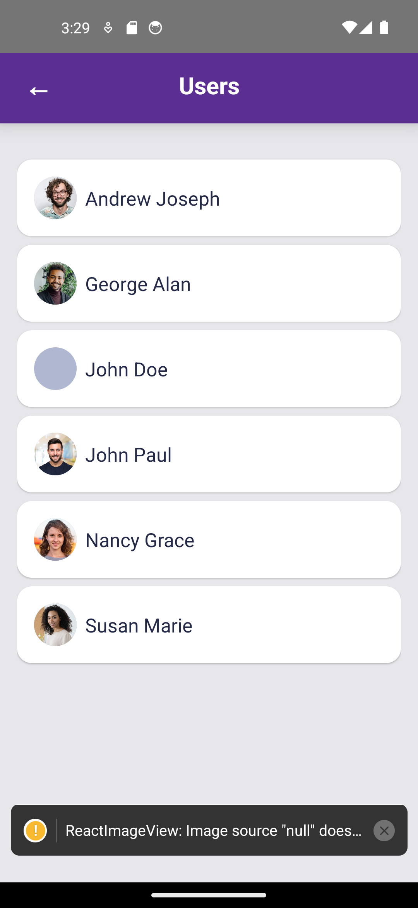
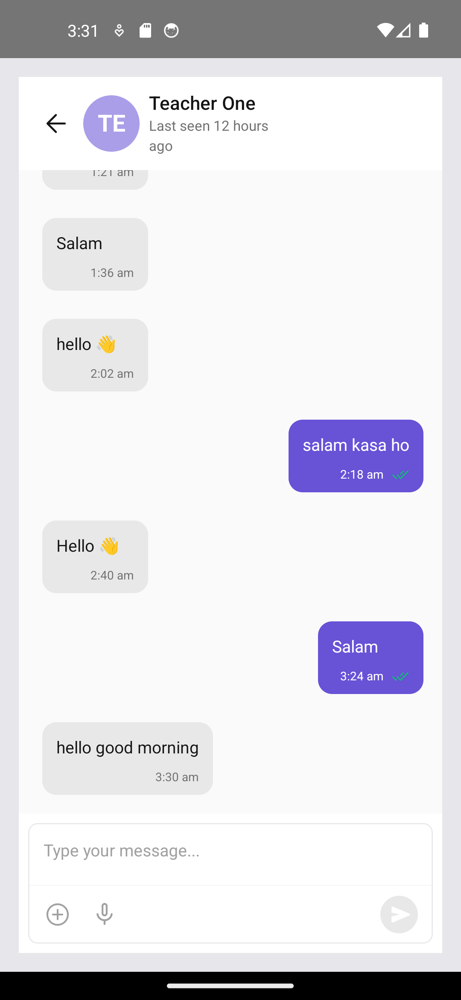
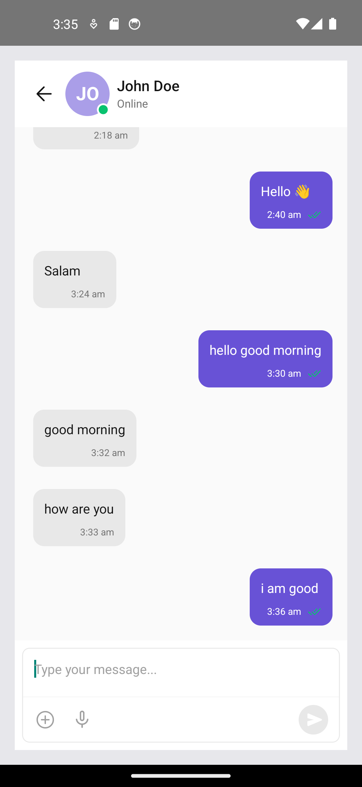

# 📲 CometChat Integration - React Native CLI App

This project showcases the integration of CometChat's React Native UI Kit using **custom components**, such as Login, Users List, and a fully functional Messaging screen.

---

## 🚀 Overview

- 💬 One-on-one chat
- 🧑 User login via UID
- 📄 Custom UI with CometChat components
- ✅ Successfully tested on both emulator and physical device

---

## 🧰 Tech Stack

- React Native CLI (TypeScript)
- CometChat UI Kit (`@cometchat/chat-uikit-react-native`)
- Android Emulator & Physical Device
- Hermes (optional)

---

## 🔧 Setup Instructions

### 1. Install dependencies

```bash
npm install
```

### 2. Configure CometChat credentials in `App.tsx`

```ts
const APP_ID = "278702d5acd2788b";
const AUTH_KEY = "ee217882a89f3757f9c783585e93c85c4f6f6418";
const REGION = "us";
const DEMO_UID = "teacher_1"; // like "superhero1"
```

> ⚠️ Replace the placeholders above with actual CometChat values from your dashboard.

### 3. Run the app

```bash
npx react-native run-android
```

---

## 🐛 Issues Faced

### ❌ TurboModule FileManager Error

```
Error: Exception in HostObject::get for prop 'FileManager' ...
TurboModule system assumes returnType == void iff the method is synchronous.
```

### ❌ CometChatMessageComposer undefined

```
TypeError: Cannot read property 'CometChatMessageComposer' of undefined
```

---

## ✅ Solutions & Fixes

- Disabled Hermes when needed (edit `android/gradle.properties`):

```properties
hermesEnabled=false
```

- Reinstalled CometChat dependencies to fix undefined components:

```bash
npm install @cometchat/chat-uikit-react-native
```

- Performed full Android clean:

```bash
cd android
./gradlew clean
cd ..
npx react-native run-android
```

- Ensured correct imports and conditional rendering of UI Kit components

---


## 📸 Screenshots

| Login Screen | Users List | Chat Screen | Other Screens |
|--------------|------------|-------------|---------------|
|  |  |  |  |


---

## 📎 Folder Structure

```
📁 src
 ┣ 📁 components
 ┃ ┣ 📄 AppTheme.ts
 ┃ ┣ 📄 Login.tsx
 ┃ ┣ 📄 UsersList.tsx
 ┃ ┣ 📄 CustomHeader.tsx
 ┃ ┣ 📄 CustomButton.tsx
 ┃ ┗ 📄 Messages.tsx
 ┣ 📁 screens
 ┃ ┣ 📄 LoginScreen.tsx
 ┃ ┗ 📄 UsersListScreen.tsx
📄 App.tsx
```

---

## 💡 Features

- Custom login form
- FlatList-based user listing
- Custom header with back navigation
- Full screen message composer and message list
- Cross-device support

---

## 📤 Submission

This project is part of the **CometChat Internship Task**.

- ✅ Code is live on GitHub
- ✅ All issues and solutions are documented
- ✅ Screenshots attached
- ✅ Email sent to `careers.intern@cometchat.com`

---

## 🙏 Special Thanks

Thanks to **CometChat** for providing the UI Kit and this internship opportunity.

👉 [Star CometChat on GitHub](https://github.com/cometchat-pro)  
👉 [Follow CometChat Organization](https://github.com/cometchat-pro)

---

## 📎 GitHub Repo

> Add this link after pushing your code:

🔗 **GitHub Link**: [https://github.com/your-username/cometchat-integration](https://github.com/your-username/cometchat-integration)

---
